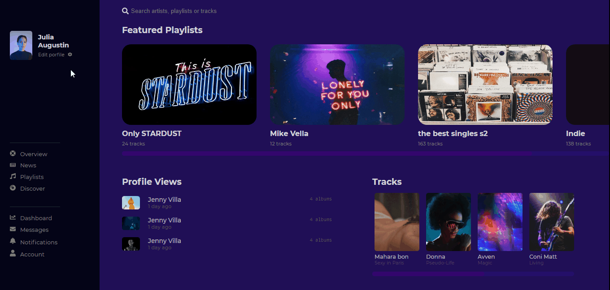
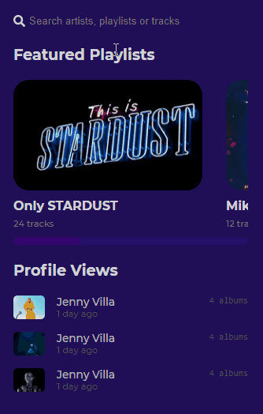

# Music Page

 </img>
 </img>

# Interaçoes:
+ scroll css estilizado
+ Menu mobile none e interativo  
+ Page Responsiva  
 

## Tecnologias:

+ Html
+ Css
+ Javascript

## Style:
<pre>
  beckground-color: rgb(32, 15, 86); 
  beckground-color: #040517; 
  font-family:'Montserrat' , monospace ; 
  display: grid; 
  </pre>